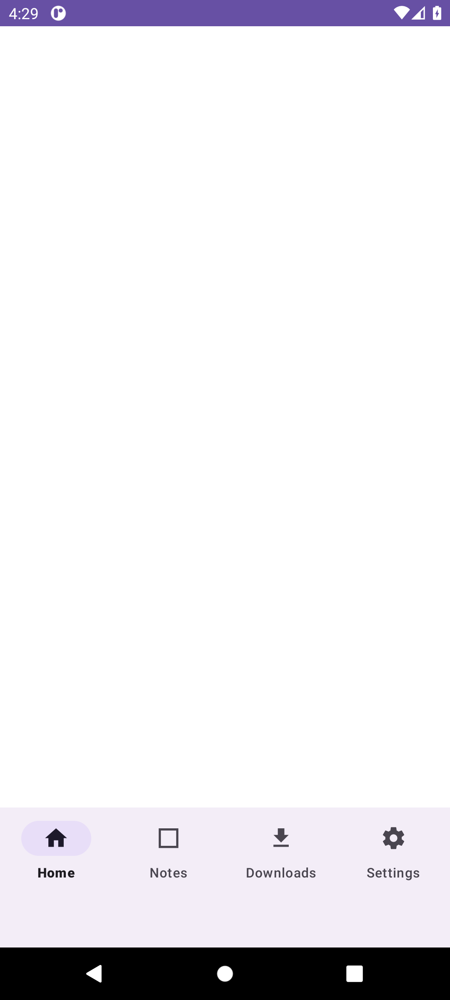
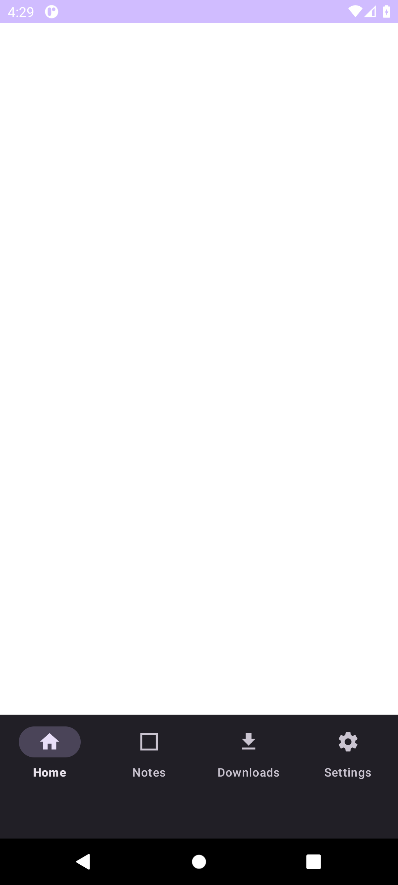
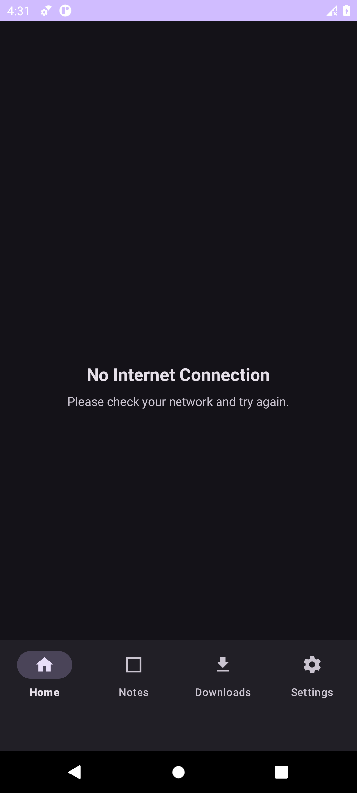

# Guptrix

Guptrix is a secure, cross-platform encrypted notes application designed to keep your private thoughts, files, and attachments completely hidden and safe. The platform consists of a robust Next.js frontend, an Express/MongoDB backend, and a dedicated Android WebView application for mobile users.

## Screenshots

## Architecture

The project is structured into three main repositories/folders:

- `Guptrix_FE`: The Next.js frontend application providing the user interface and client-side encryption.
- `Guptrix_BE`: The Express.js backend handling user authentication, encrypted database storage, and REST API routes.
- `android-app`: The Android WebView application acting as a native mobile wrapper with secure native downloading hooks and hardware integration.

## Features

- **End-to-End Encryption**: Notes are encrypted locally before ever reaching the server.
- **Attachments Support**: Securely attach files to your notes using Base64/Blob serialization.
- **Cross-Platform**: Access via any modern web browser or through the dedicated Android application.
- **Zero-Knowledge Architecture**: The server only stores encrypted ciphertext.

## Setup Instructions

### Prerequisites
- Node.js (v18+)
- MongoDB Instance
- Android Studio (For mobile compilation)

### Backend (`Guptrix_BE`)
1. Navigate to the `Guptrix_BE` directory.
2. Run `npm install` to install dependencies.
3. Create a `.env` file with `DATABASE_URL`, `JWT_SECRET`, and `SMTP_PASS` parameters.
4. Run `npm run dev` to start the backend server.

### Frontend (`Guptrix_FE`)
1. Navigate to the `Guptrix_FE` directory.
2. Run `npm install`.
3. Create a `.env.local` file with the required environment variables pointing to your backend.
4. Run `npm run dev` to start the Next.js development server.

### Android Application (`android-app`)
1. Open the `android-app` directory in Android Studio.
2. Set your environment variables (`KEYSTORE_PASSWORD`, `KEY_ALIAS`, `KEY_PASSWORD`) if building a release version.
3. Build and deploy the application to your emulator or physical device.

## Deployment Instructions

Both the frontend and backend are Docker-ready and can be deployed to platforms like Vercel (Frontend) and Render/Heroku (Backend). Ensure you inject your secure `.env` files dynamically through your cloud provider's secret manager.

## Developers

- [Ritik Thakur](https://github.com/ritikthakur22)
- [Adarsh](https://github.com/A-adarsh1)
